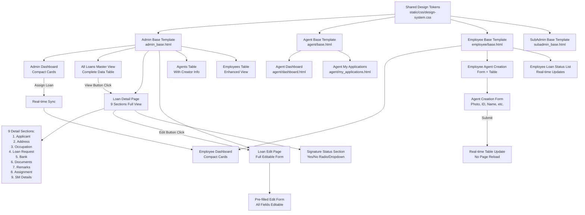
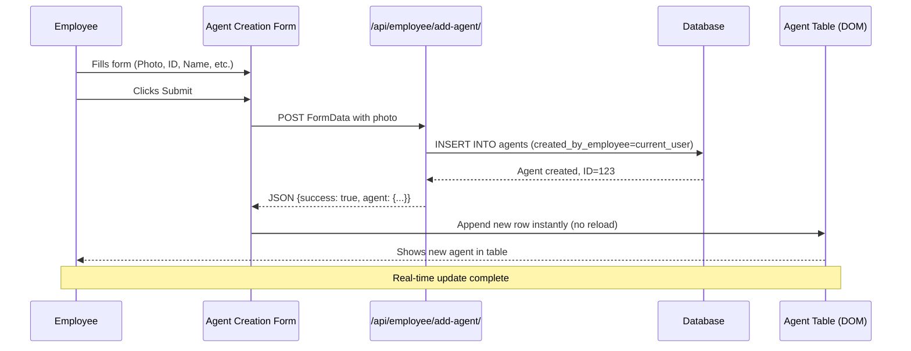
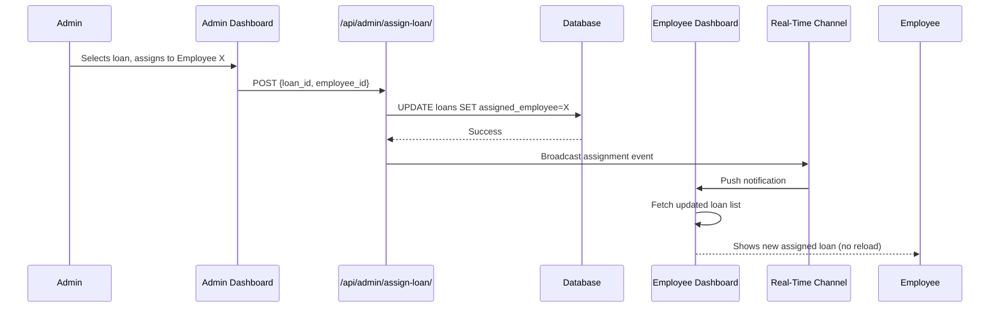
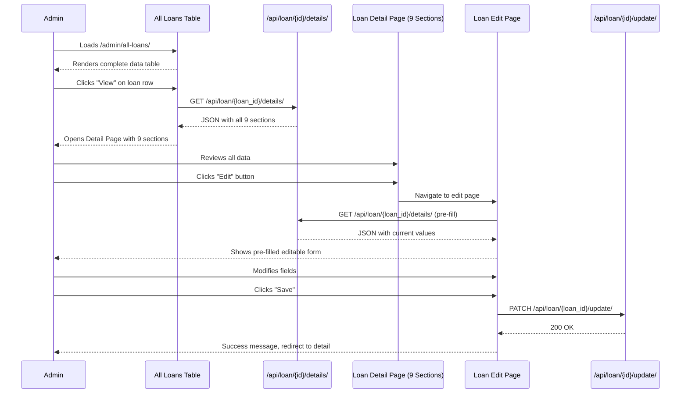
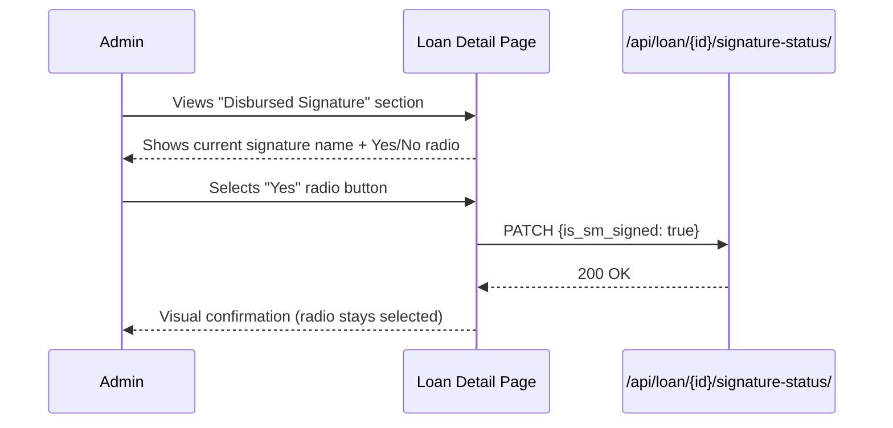

# Design Document: UI/UX Redesign

## Overview

This feature delivers a comprehensive visual and functional redesign of the DSA Loan Management System — a Django-based multi-panel application serving Admin, SubAdmin, Employee, and Agent roles. The redesign encompasses both UI/UX improvements and significant backend functionality expansions.

**Visual Redesign**: Modern, professional aesthetic with consistent spacing, soft shadows, rounded corners, and a cohesive teal-based color scheme across all panels and cards. The application uses Bootstrap 5 as the foundation, with a unified design token system (CSS custom properties) and consistent component patterns.

**Functional Enhancements**:
1. **Employee Agent Creation**: Employees can create and manage their own agents with full CRUD operations
2. **Real-Time Data Synchronization**: Instant updates across Admin and Employee panels without page reloads
3. **Enhanced All Loans View**: Comprehensive master database view with complete loan data and filtering
4. **Full Loan Detail Page**: 9-section detailed view with all applicant, loan, bank, and document information
5. **Full Loan Edit Page**: Admin can edit all loan fields with pre-filled forms and audit trail
6. **Signature Status Redesign**: "SM Name" renamed to "Disbursed Signature" with Yes/No radio/dropdown instead of Sign button
7. **Compact Dashboard Cards**: Small, 1-row gradient cards replacing oversized stat cards
8. **UI Framework Strategy**: Hybrid Bootstrap 5 + Tailwind CSS utility classes approach

The system maintains backward compatibility with existing Django models and views while adding new endpoints and real-time APIs.

## Architecture



## Sequence Diagrams

### Employee Creates Agent Flow (Real-Time)



### Admin Assigns Loan → Employee Panel Updates (Real-Time)



### Admin Views Loan Detail → Edit Flow



### Signature Status Yes/No Selection Flow



## Components and Interfaces

### Component 1: Design Token System

**Purpose**: Single source of truth for all visual variables — colors, spacing, shadows, radii, typography.

**Interface** (CSS custom properties in `static/css/design-system.css`):
```css
:root {
  --color-primary: #0f766e;
  --color-primary-dark: #0b5f57;
  --color-primary-light: #ccfbf1;
  --color-accent: #1abc9c;
  --color-surface: #ffffff;
  --color-background: #f0fdf9;
  --color-border: #e2e8f0;
  --color-text-primary: #1a202c;
  --color-text-secondary: #718096;
  --color-text-muted: #a0aec0;
  --color-success: #10b981;
  --color-warning: #f59e0b;
  --color-danger: #ef4444;
  --color-info: #3b82f6;
  --space-1: 4px; --space-2: 8px; --space-3: 12px;
  --space-4: 16px; --space-5: 20px; --space-6: 24px; --space-8: 32px;
  --shadow-sm: 0 1px 3px rgba(0,0,0,0.08);
  --shadow-md: 0 4px 12px rgba(0,0,0,0.10);
  --shadow-lg: 0 8px 24px rgba(0,0,0,0.12);
  --shadow-card: 0 2px 8px rgba(15,118,110,0.08);
  --radius-sm: 6px; --radius-md: 10px; --radius-lg: 16px; --radius-xl: 20px;
  --font-size-xs: 11px; --font-size-sm: 13px; --font-size-base: 14px;
  --font-size-lg: 16px; --font-size-xl: 20px; --font-size-2xl: 24px;
}
```

**Responsibilities**:
- Provide consistent visual language across all panels
- Enable easy theme changes from one file
- Eliminate inline style duplication across templates

### Component 2: Enhanced Card Component

**Purpose**: Reusable card pattern for stat cards, info panels, and section containers.

**Interface** (HTML pattern):
```html
<div class="ds-card">
  <div class="ds-card__header">
    <h3 class="ds-card__title">Section Title</h3>
  </div>
  <div class="ds-card__body">
    <!-- content -->
  </div>
</div>
```

**Responsibilities**:
- Consistent rounded corners (`--radius-lg`), soft shadow (`--shadow-card`), white background
- Hover lift effect on interactive cards
- Responsive padding

### Component 3: Enhanced Table Component

**Purpose**: Styled table for Employee, Agent, and Loan tables with hover, striped rows, and responsive wrapper.

**Interface** (HTML pattern):
```html
<div class="ds-table-wrapper">
  <table class="ds-table">
    <thead>
      <tr><th>Column</th></tr>
    </thead>
    <tbody>
      <tr class="ds-table__row">
        <td>Value</td>
      </tr>
    </tbody>
  </table>
</div>
```

**Responsibilities**:
- Teal gradient header row
- Alternating row colors (striped via `nth-child(even)`)
- Hover highlight on rows
- Responsive horizontal scroll on small screens
- Clear typography hierarchy

### Component 4: Employee Agent Creation Form

**Purpose**: Allow employees to create and manage agents under their supervision.

**Interface** (Django view + HTML form):
```python
# core/employee_views_new.py
@login_required
@require_http_methods(["POST"])
def employee_add_agent_api(request: HttpRequest) -> JsonResponse:
    """
    Preconditions: 
    - request.user.role == 'employee'
    - FormData contains: photo, agent_id, full_name, password, phone, email, address, city, state, pincode, status
    Postconditions:
    - Agent created with created_by_employee = request.user
    - Returns JSON {success: true, agent: {...}}
    - Real-time table update triggered
    """
```

**HTML Form Pattern**:
```html
<form id="agentCreationForm" enctype="multipart/form-data">
  <input type="file" name="photo" accept="image/*" required>
  <input type="text" name="agent_id" placeholder="Agent ID" required>
  <input type="text" name="full_name" placeholder="Full Name" required>
  <input type="password" name="password" placeholder="Password" required>
  <input type="tel" name="phone" placeholder="Phone" required>
  <input type="email" name="email" placeholder="Email" required>
  <textarea name="address" placeholder="Address"></textarea>
  <input type="text" name="city" placeholder="City">
  <input type="text" name="state" placeholder="State">
  <input type="text" name="pincode" placeholder="Pincode" maxlength="6">
  <select name="status">
    <option value="active">Active</option>
    <option value="inactive">Inactive</option>
  </select>
  <button type="submit">Create Agent</button>
</form>
```

**Responsibilities**:
- Validate all required fields (photo, agent_id, full_name, password, phone, email)
- Link agent to current employee via `created_by_employee` foreign key
- Upload and store profile photo
- Return JSON response for real-time table update
- Show success/error toast notifications

### Component 5: Employee Agent Table (Filtered View)

**Purpose**: Display agents created by the current employee with filtering logic.

**Interface** (Django queryset):
```python
# Employee view: Only agents created by this employee
agents = Agent.objects.filter(created_by_employee=request.user)

# Admin view: All agents with creator information
agents = Agent.objects.select_related('created_by_employee').all()
```

**Table Columns**:
- Photo (thumbnail)
- Agent ID
- Name
- Phone
- Email
- Created By (Employee/Admin name)
- Status (Active/Inactive badge)
- Total Loans (count)
- Actions (View/Edit/Delete buttons)

**Responsibilities**:
- Filter agents by creator for employees
- Show all agents for admin with creator column
- Real-time row insertion after agent creation
- Responsive table with horizontal scroll on mobile

### Component 6: Compact Dashboard Card Component

**Purpose**: Small, 1-row gradient cards for dashboard stats (replacing oversized cards).

**Interface** (HTML pattern):
```html
<div class="ds-compact-card ds-compact-card--gradient-teal">
  <div class="ds-compact-card__icon">
    <i class="fas fa-file-alt"></i>
  </div>
  <div class="ds-compact-card__content">
    <h4 class="ds-compact-card__value">{{ count }}</h4>
    <p class="ds-compact-card__label">Total Loans</p>
  </div>
  <div class="ds-compact-card__action">
    <a href="" class="ds-compact-card__link">
      <i class="fas fa-arrow-right"></i>
    </a>
  </div>
</div>
```

**CSS Specifications**:
```css
.ds-compact-card {
  display: flex;
  align-items: center;
  padding: var(--space-4);
  border-radius: var(--radius-md);
  box-shadow: var(--shadow-card);
  background: linear-gradient(135deg, var(--color-primary), var(--color-primary-dark));
  color: white;
  transition: transform 0.2s, box-shadow 0.2s;
  cursor: pointer;
  min-height: 80px; /* 1-row height */
}

.ds-compact-card:hover {
  transform: translateY(-2px);
  box-shadow: var(--shadow-lg);
}

.ds-compact-card__icon {
  font-size: 32px;
  margin-right: var(--space-4);
}

.ds-compact-card__value {
  font-size: var(--font-size-2xl);
  font-weight: 700;
  margin: 0;
}

.ds-compact-card__label {
  font-size: var(--font-size-sm);
  opacity: 0.9;
  margin: 0;
}
```

**Gradient Variants**:
- `--gradient-teal`: Total Loans
- `--gradient-blue`: In Processing
- `--gradient-green`: Approved
- `--gradient-red`: Rejected

**Responsibilities**:
- Display single stat in compact format
- Clickable card opens filtered table view
- Hover lift effect
- Responsive sizing (stack on mobile)

### Component 7: All Loans Master View (Enhanced)

**Purpose**: Comprehensive table showing complete loan data with all required columns.

**Interface** (Django view):
```python
@login_required
@admin_required
def admin_all_loans(request: HttpRequest) -> HttpResponse:
    """
    Preconditions: request.user.role == 'admin'
    Postconditions: renders all_loans.html with complete loan queryset
    """
    loans = Loan.objects.select_related(
        'assigned_employee', 'assigned_agent', 'created_by'
    ).prefetch_related('documents').all().order_by('-created_at')
```

**Table Columns** (10 required):
1. Loan ID
2. Applicant Name
3. Phone
4. Loan Type
5. Amount
6. Submitted By (Agent/SubAgent name)
7. Assigned Employee
8. Status (badge with color)
9. Created Date
10. Actions (View/Edit/Delete buttons)

**Responsibilities**:
- Display all loans in system (admin master view)
- Filter by status, date range, search query
- Pagination (25 loans per page)
- Export to CSV/Excel
- Real-time updates when new loans added

### Component 8: Loan Detail Page (9 Sections)

**Purpose**: Full-page detail view with all captured loan data organized into 9 sections.

**Interface** (Django view):
```python
@login_required
@admin_required
def admin_loan_detail(request: HttpRequest, loan_id: int) -> HttpResponse:
    """
    Preconditions: loan_id exists, user is admin
    Postconditions: renders loan_detail.html with 9-section context
    """
    loan = Loan.objects.select_related(
        'assigned_employee', 'assigned_agent', 'created_by'
    ).prefetch_related('documents', 'status_history').get(id=loan_id)
```

**9 Detail Sections**:

**Section 1: Applicant Details**
- Full Name, Phone, Email, Gender, Date of Birth
- PAN Number, Aadhaar Number, CIBIL Score

**Section 2: Address Details**
- Permanent Address (Line 1, Line 2, Landmark, City, State, Pincode)
- Current Address (same fields)
- "Same as Permanent" checkbox indicator

**Section 3: Occupation & Income Details**
- Occupation Type, Employer Name, Date of Joining
- Years of Experience, Monthly Income, Annual Income
- Additional Income Sources, Extra Income Details

**Section 4: Loan Request Details**
- Loan Type, Loan Amount, Tenure (months)
- Interest Rate, EMI, Loan Purpose
- Charges/Fees Applicable

**Section 5: Bank Details**
- Bank Name, Bank Type (Private/Government/Cooperative/NBFC)
- Account Number, IFSC Code
- Branch Name, Branch Address

**Section 6: All Uploaded Documents**
- Document Type, File Name, Upload Date
- View (opens in new tab) and Download buttons
- Document thumbnails for images

**Section 7: Remarks History**
- All remarks with timestamps
- User who added remark
- Chronological order (newest first)

**Section 8: Assignment Details**
- Assigned To (Employee/Agent name)
- Assigned By (Admin name)
- Assigned Date, Hours Since Assignment
- Assignment Notes

**Section 9: SM Details (Disbursed Signature)**
- SM Name (renamed to "Disbursed Signature")
- SM Phone Number
- SM Email
- Signature Status: Yes/No radio buttons (replaces Sign button)
- Signed Date (if Yes selected)

**Responsibilities**:
- Display all captured data in organized sections
- Card-based layout with section dividers
- Professional fintech look with consistent spacing
- Edit button at top-right (navigates to edit page)
- Print/Export PDF button

### Component 9: Loan Edit Page (Full Editable Form)

**Purpose**: Admin can edit all loan fields with pre-filled values and audit trail.

**Interface** (Django view):
```python
@login_required
@admin_required
def admin_loan_edit(request: HttpRequest, loan_id: int) -> HttpResponse:
    """
    GET: Pre-fill form with current loan data
    POST: Update loan with new values, maintain audit history
    
    Preconditions: loan_id exists, user is admin
    Postconditions: 
    - GET: renders edit form with pre-filled values
    - POST: updates loan, creates audit log entry, redirects to detail page
    """
```

**Editable Fields** (organized by section):
- All Applicant Details (name, phone, email, DOB, gender, PAN, Aadhaar, CIBIL)
- All Address Details (permanent, current, city, state, pincode)
- All Occupation Details (occupation, employer, income, experience)
- All Loan Details (type, amount, tenure, interest rate, purpose)
- All Bank Details (bank name, type, account number, IFSC)
- SM Details (name, phone, email)
- Remarks (append new remark with timestamp)

**Form Behavior**:
- Pre-fill all fields with current values
- Validate on client-side (required fields, format checks)
- Submit via AJAX (no page reload)
- Show success toast on save
- Maintain audit history (who edited, when, what changed)

**Responsibilities**:
- Load current loan data into form fields
- Validate all inputs before submission
- Update loan record in database
- Create audit log entry with changes
- Redirect to detail page after successful save

### Component 10: Signature Status Radio/Dropdown

**Purpose**: Replace "Sign" button with Yes/No selection for signature confirmation.

**Interface** (HTML pattern):
```html
<div class="ds-signature-section">
  <div class="ds-field-group">
    <label class="ds-field-label">Disbursed Signature</label>
    <p id="detailSmName" class="ds-field-value">{{ loan.sm_name|default:"-" }}</p>
  </div>
  
  <div class="ds-field-group mt-3">
    <label class="ds-field-label">Signature Status</label>
    <div class="ds-radio-group">
      <label class="ds-radio-label">
        <input type="radio" name="signature_status" value="yes" 
               checked
               onchange="updateSignatureStatus({{ loan.id }}, true)">
        <span class="ds-radio-text">Yes</span>
      </label>
      <label class="ds-radio-label">
        <input type="radio" name="signature_status" value="no" 
               checked
               onchange="updateSignatureStatus({{ loan.id }}, false)">
        <span class="ds-radio-text">No</span>
      </label>
    </div>
  </div>
  
  
  <div class="ds-field-group mt-2">
    <label class="ds-field-label">Signed Date</label>
    <p class="ds-field-value">{{ loan.sm_signed_at|date:"Y-m-d H:i" }}</p>
  </div>
  
</div>
```

**JavaScript Handler**:
```javascript
function updateSignatureStatus(loanId, isSigned) {
  fetch(`/api/loan/${loanId}/signature-status/`, {
    method: 'PATCH',
    headers: {
      'Content-Type': 'application/json',
      'X-CSRFToken': getCookie('csrftoken')
    },
    body: JSON.stringify({ is_sm_signed: isSigned })
  })
  .then(response => response.json())
  .then(data => {
    if (data.success) {
      showToast('Signature status updated', 'success');
      if (isSigned && data.signed_at) {
        // Update signed date display
        document.querySelector('.signed-date-display').textContent = data.signed_at;
      }
    } else {
      showToast('Failed to update status', 'error');
    }
  });
}
```

**Responsibilities**:
- Display current signature status as radio selection
- Update `is_sm_signed` field on selection change
- Set `sm_signed_at` timestamp when Yes selected
- Show signed date if status is Yes
- Provide visual feedback on save

### Component 11: Real-Time Update Mechanism

**Purpose**: Enable instant data synchronization across Admin and Employee panels without page reloads.

**Interface** (AJAX polling approach):
```javascript
// Real-time polling for dashboard updates
class RealTimeUpdater {
  constructor(endpoint, interval = 5000) {
    this.endpoint = endpoint;
    this.interval = interval;
    this.timerId = null;
  }
  
  start() {
    this.timerId = setInterval(() => this.fetchUpdates(), this.interval);
  }
  
  stop() {
    if (this.timerId) clearInterval(this.timerId);
  }
  
  async fetchUpdates() {
    try {
      const response = await fetch(this.endpoint);
      const data = await response.json();
      this.handleUpdate(data);
    } catch (error) {
      console.error('Real-time update failed:', error);
    }
  }
  
  handleUpdate(data) {
    // Override in subclass
  }
}

// Employee dashboard updater
class EmployeeDashboardUpdater extends RealTimeUpdater {
  handleUpdate(data) {
    // Update loan counts
    document.getElementById('totalLoansCount').textContent = data.total_loans;
    document.getElementById('processingCount').textContent = data.processing;
    document.getElementById('approvedCount').textContent = data.approved;
    
    // Update loan table if new loans assigned
    if (data.new_loans && data.new_loans.length > 0) {
      this.appendNewLoans(data.new_loans);
    }
  }
  
  appendNewLoans(loans) {
    const tbody = document.querySelector('#loansTable tbody');
    loans.forEach(loan => {
      const row = this.createLoanRow(loan);
      tbody.insertBefore(row, tbody.firstChild);
    });
  }
}
```

**API Endpoints for Real-Time**:
- `/api/employee/dashboard-stats/` - Returns updated counts every 5 seconds
- `/api/admin/recent-assignments/` - Returns new assignments since last poll
- `/api/employee/new-loans/` - Returns loans assigned since last check

**Responsibilities**:
- Poll API endpoints at regular intervals (5 seconds)
- Update DOM elements with new data
- Append new rows to tables without full reload
- Show toast notifications for new assignments
- Minimize server load with efficient queries

### Component 12: Original Loan Detail Page (Legacy - Now Enhanced)

**Purpose**: Full-page detail view opened when admin clicks "View" on any loan in the All Loans table.

**Interface** (Django view):
```python
# core/admin_all_loans_views.py
def admin_loan_detail(request: HttpRequest, loan_id: int) -> HttpResponse:
    """
    Preconditions: loan_id exists, user is admin
    Postconditions: renders all_loans_detail.html with full loan context
    """
```

**Responsibilities**:
- Organized sections: Applicant Info, Loan Details, Bank Details, Signature, Documents, Status History
- Clean card-based layout with section dividers
- "Disbursed Signature" label (renamed from "SM Name")
- Yes/No toggle below signature section

### Component 13: Original Disbursed Signature Section (Legacy - Now Enhanced)

**Purpose**: Display and capture the disbursement signature confirmation.

**Interface** (HTML within loan detail):
```html
<div class="ds-signature-section">
  <label class="ds-field-label">Disbursed Signature</label>
  <p id="detailSmName" class="ds-field-value">-</p>
  <label class="ds-field-label mt-3">Disbursement Confirmed?</label>
  <div class="ds-toggle-group" id="disbursedConfirmedToggle">
    <button class="ds-toggle-btn ds-toggle-btn--yes" data-value="yes">Yes</button>
    <button class="ds-toggle-btn ds-toggle-btn--no" data-value="no">No</button>
  </div>
</div>
```

**Responsibilities**:
- Clearly label the field as "Disbursed Signature"
- Provide Yes/No toggle buttons for disbursement confirmation
- Persist selection via existing `api_update_disbursed_details` endpoint
- Visually indicate selected state

## Data Models

### Model Updates Required

**Agent Model Enhancement** (add `created_by_employee` field):

```python
# core/models.py
class Agent(models.Model):
    # ... existing fields ...
    created_by = models.ForeignKey(
        User, 
        on_delete=models.SET_NULL, 
        null=True, 
        related_name='created_agents'
    )
    created_by_employee = models.ForeignKey(
        User,
        on_delete=models.SET_NULL,
        null=True,
        blank=True,
        related_name='employee_created_agents',
        limit_choices_to={'role': 'employee'},
        help_text="Employee who created this agent"
    )
    # ... rest of fields ...
```

**Migration Required**:
```python
# core/migrations/0023_agent_created_by_employee.py
from django.db import migrations, models
import django.db.models.deletion

class Migration(migrations.Migration):
    dependencies = [
        ('core', '0022_useronboardingprofile_useronboardingdocument'),
    ]

    operations = [
        migrations.AddField(
            model_name='agent',
            name='created_by_employee',
            field=models.ForeignKey(
                blank=True,
                help_text='Employee who created this agent',
                limit_choices_to={'role': 'employee'},
                null=True,
                on_delete=django.db.models.deletion.SET_NULL,
                related_name='employee_created_agents',
                to='core.user'
            ),
        ),
    ]
```

### Existing Fields Used (No Changes Needed)

**Loan Model** (already has all required fields):
```python
class Loan(models.Model):
    # Applicant fields
    full_name = models.CharField(max_length=100)
    mobile_number = models.CharField(max_length=15)
    email = models.EmailField(blank=True, null=True)
    
    # Address fields
    permanent_address = models.TextField(blank=True, null=True)
    current_address = models.TextField(blank=True, null=True)
    city = models.CharField(max_length=50, blank=True, null=True)
    state = models.CharField(max_length=50, blank=True, null=True)
    pin_code = models.CharField(max_length=6, blank=True, null=True)
    
    # Loan fields
    loan_type = models.CharField(max_length=50, choices=LOAN_TYPE_CHOICES)
    loan_amount = models.DecimalField(max_digits=15, decimal_places=2)
    tenure_months = models.IntegerField(blank=True, null=True)
    interest_rate = models.DecimalField(max_digits=5, decimal_places=2, blank=True, null=True)
    loan_purpose = models.CharField(max_length=200, blank=True, null=True)
    
    # Bank fields
    bank_name = models.CharField(max_length=100, blank=True, null=True)
    bank_account_number = models.CharField(max_length=50, blank=True, null=True)
    bank_ifsc_code = models.CharField(max_length=20, blank=True, null=True)
    bank_type = models.CharField(max_length=20, choices=BANK_TYPE_CHOICES, blank=True, null=True)
    
    # SM/Signature fields (used for Disbursed Signature section)
    sm_name = models.CharField(max_length=120, blank=True, null=True)
    sm_phone_number = models.CharField(max_length=20, blank=True, null=True)
    sm_email = models.EmailField(blank=True, null=True)
    is_sm_signed = models.BooleanField(default=False)  # Maps to Yes/No radio
    sm_signed_at = models.DateTimeField(null=True, blank=True)
    
    # Assignment fields
    assigned_employee = models.ForeignKey(User, on_delete=models.SET_NULL, null=True, blank=True, related_name='loans_as_employee')
    assigned_agent = models.ForeignKey(Agent, on_delete=models.SET_NULL, null=True, blank=True, related_name='loans')
    created_by = models.ForeignKey(User, on_delete=models.SET_NULL, null=True, related_name='created_loans')
    
    # Status and timestamps
    status = models.CharField(max_length=20, choices=STATUS_CHOICES, default='new_entry')
    created_at = models.DateTimeField(auto_now_add=True)
    updated_at = models.DateTimeField(auto_now=True)
```

**Agent Model** (existing fields):
```python
class Agent(models.Model):
    user = models.OneToOneField(User, on_delete=models.CASCADE, null=True, blank=True, related_name='agent_profile')
    agent_id = models.CharField(max_length=50, unique=True, null=True, blank=True)
    name = models.CharField(max_length=100)
    phone = models.CharField(max_length=15)
    email = models.EmailField(blank=True, null=True)
    address = models.TextField(blank=True, null=True)
    city = models.CharField(max_length=50, blank=True, null=True)
    state = models.CharField(max_length=50, blank=True, null=True)
    pin_code = models.CharField(max_length=6, blank=True, null=True)
    profile_photo = models.ImageField(upload_to='agent_photos/', blank=True, null=True)
    status = models.CharField(max_length=20, choices=[('active', 'Active'), ('blocked', 'Blocked')], default='active')
    created_by = models.ForeignKey(User, on_delete=models.SET_NULL, null=True, related_name='created_agents')
    created_at = models.DateTimeField(auto_now_add=True)
```

### Validation Rules

**Agent Creation**:
- `agent_id` must be unique across all agents
- `phone` must be valid format (regex: `^\+?1?\d{9,15}$`)
- `email` must be unique if provided
- `profile_photo` max size: 5MB, formats: jpg, jpeg, png, gif
- `created_by_employee` must reference a User with `role='employee'`

**Signature Status**:
- `is_sm_signed` is boolean; radio sends `true`/`false`
- When `is_sm_signed` changes to `true`, set `sm_signed_at` to current timestamp
- When `is_sm_signed` changes to `false`, clear `sm_signed_at`

**Loan Edit Audit**:
- Create `LoanEditHistory` entry on each save (optional enhancement)
- Track: `edited_by`, `edited_at`, `fields_changed` (JSON), `old_values` (JSON), `new_values` (JSON)

## Algorithmic Pseudocode

### Employee Agent Creation Algorithm

```pascal
ALGORITHM employeeCreateAgent(request)
INPUT: request with FormData (photo, agent_id, full_name, password, phone, email, address, city, state, pincode, status)
OUTPUT: JSON response with created agent data

BEGIN
  // Preconditions
  ASSERT request.user.role = 'employee'
  ASSERT request.method = 'POST'
  
  // Step 1: Extract and validate form data
  photo ← request.FILES.get('photo')
  agent_id ← request.POST.get('agent_id').strip()
  full_name ← request.POST.get('full_name').strip()
  password ← request.POST.get('password')
  phone ← request.POST.get('phone').strip()
  email ← request.POST.get('email').strip()
  address ← request.POST.get('address', '').strip()
  city ← request.POST.get('city', '').strip()
  state ← request.POST.get('state', '').strip()
  pincode ← request.POST.get('pincode', '').strip()
  status ← request.POST.get('status', 'active')
  
  // Step 2: Validate required fields
  IF NOT (photo AND agent_id AND full_name AND password AND phone AND email) THEN
    RETURN JSON {success: false, error: "All required fields must be filled"}
  END IF
  
  // Step 3: Check uniqueness constraints
  IF Agent.objects.filter(agent_id=agent_id).exists() THEN
    RETURN JSON {success: false, error: "Agent ID already exists"}
  END IF
  
  IF User.objects.filter(email=email).exists() THEN
    RETURN JSON {success: false, error: "Email already registered"}
  END IF
  
  IF User.objects.filter(phone=phone).exists() THEN
    RETURN JSON {success: false, error: "Phone already registered"}
  END IF
  
  // Step 4: Validate photo size
  IF photo.size > 5 * 1024 * 1024 THEN
    RETURN JSON {success: false, error: "Photo must be less than 5MB"}
  END IF
  
  // Step 5: Parse full name
  name_parts ← full_name.split(' ', 1)
  first_name ← name_parts[0]
  last_name ← name_parts[1] IF len(name_parts) > 1 ELSE ''
  
  // Step 6: Create User account
  username ← email.split('@')[0]
  user ← User.objects.create_user(
    username=username,
    email=email,
    password=password,
    role='agent',
    first_name=first_name,
    last_name=last_name,
    phone=phone,
    profile_photo=photo
  )
  
  // Step 7: Create Agent profile
  agent ← Agent.objects.create(
    user=user,
    agent_id=agent_id,
    name=full_name,
    phone=phone,
    email=email,
    address=address IF address ELSE NULL,
    city=city IF city ELSE NULL,
    state=state IF state ELSE NULL,
    pin_code=pincode IF pincode ELSE NULL,
    profile_photo=photo,
    status=status,
    created_by=request.user,
    created_by_employee=request.user  // CRITICAL: Link to employee
  )
  
  // Step 8: Return success response
  RETURN JSON {
    success: true,
    message: "Agent created successfully",
    agent: {
      id: agent.id,
      agent_id: agent.agent_id,
      name: agent.name,
      phone: agent.phone,
      email: agent.email,
      status: agent.status,
      created_by: request.user.get_full_name(),
      total_loans: 0
    }
  }
  
  // Postconditions
  ASSERT agent.created_by_employee = request.user
  ASSERT agent.user.role = 'agent'
END
```

### Real-Time Table Update Algorithm

```pascal
ALGORITHM realTimeTableUpdate(apiResponse)
INPUT: apiResponse (JSON with new agent data)
OUTPUT: updated DOM table with new row

BEGIN
  // Step 1: Parse response
  IF NOT apiResponse.success THEN
    SHOW error toast apiResponse.error
    RETURN
  END IF
  
  agent ← apiResponse.agent
  
  // Step 2: Create table row HTML
  row ← CREATE_ELEMENT('tr')
  row.innerHTML ← `
    <td></td>
    <td>${agent.agent_id}</td>
    <td>${agent.name}</td>
    <td>${agent.phone}</td>
    <td>${agent.email}</td>
    <td>${agent.created_by}</td>
    <td><span class="badge badge-${agent.status}">${agent.status}</span></td>
    <td>${agent.total_loans}</td>
    <td>
      <button onclick="viewAgent(${agent.id})">View</button>
      <button onclick="editAgent(${agent.id})">Edit</button>
      <button onclick="deleteAgent(${agent.id})">Delete</button>
    </td>
  `
  
  // Step 3: Insert row at top of table (newest first)
  tbody ← document.querySelector('#agentsTable tbody')
  tbody.insertBefore(row, tbody.firstChild)
  
  // Step 4: Highlight new row with animation
  row.classList.add('highlight-new-row')
  WAIT 2 seconds
  row.classList.remove('highlight-new-row')
  
  // Step 5: Update total count
  totalCount ← document.querySelector('#totalAgentsCount')
  totalCount.textContent ← parseInt(totalCount.textContent) + 1
  
  // Step 6: Show success toast
  SHOW success toast "Agent created successfully"
  
  // Step 7: Reset form
  document.querySelector('#agentCreationForm').reset()
  
  // Postconditions
  ASSERT row is visible in table
  ASSERT total count incremented by 1
END
```

### Admin All Loans Data Aggregation Algorithm

```pascal
ALGORITHM adminAllLoansView(request)
INPUT: request with optional filters (status, search, date_range)
OUTPUT: rendered HTML with complete loan data table

BEGIN
  // Preconditions
  ASSERT request.user.role = 'admin'
  
  // Step 1: Build base queryset with optimized joins
  loans ← Loan.objects.select_related(
    'assigned_employee',
    'assigned_agent',
    'created_by'
  ).prefetch_related('documents').all()
  
  // Step 2: Apply status filter
  status_filter ← request.GET.get('status', '').strip()
  IF status_filter = 'follow_up_pending' THEN
    loans ← loans.filter(
      status IN ['new_entry', 'waiting'],
      remarks__icontains='Revert Remark'
    )
  ELSE IF status_filter ≠ '' THEN
    loans ← loans.filter(status=status_filter)
    IF status_filter IN ['new_entry', 'waiting'] THEN
      loans ← loans.exclude(remarks__icontains='Revert Remark')
    END IF
  END IF
  
  // Step 3: Apply search filter
  search_query ← request.GET.get('q', '').strip()
  IF search_query ≠ '' THEN
    loans ← loans.filter(
      Q(full_name__icontains=search_query) OR
      Q(mobile_number__icontains=search_query) OR
      Q(email__icontains=search_query) OR
      Q(user_id__icontains=search_query)
    )
  END IF
  
  // Step 4: Order by creation date (newest first)
  loans ← loans.order_by('-created_at')
  
  // Step 5: Enrich each loan with display fields
  FOR each loan IN loans DO
    // Determine submitted by
    creator ← loan.created_by
    IF creator THEN
      loan.submitted_by_display ← f"{creator.get_role_display()} - {creator.get_full_name()}"
    ELSE
      loan.submitted_by_display ← 'System'
    END IF
    
    // Determine assigned to
    IF loan.assigned_employee THEN
      loan.assigned_to_display ← f"Employee - {loan.assigned_employee.get_full_name()}"
    ELSE IF loan.assigned_agent THEN
      loan.assigned_to_display ← f"Agent - {loan.assigned_agent.name}"
    ELSE
      loan.assigned_to_display ← '-'
    END IF
    
    // Check follow-up pending status
    loan.is_follow_up_pending ← (
      loan.status IN ['new_entry', 'waiting'] AND
      'revert remark' IN loan.remarks.lower()
    )
    
    // Set display status
    IF loan.is_follow_up_pending THEN
      loan.status_display ← 'Follow Up'
    ELSE
      loan.status_display ← loan.get_status_display()
    END IF
  END FOR
  
  // Step 6: Prepare context
  context ← {
    'page_title': 'All Loans - Master Database',
    'loans': loans,
    'search_query': search_query,
    'status_filter': status_filter,
    'total_loans': loans.count()
  }
  
  // Step 7: Render template
  RETURN render(request, 'core/admin/all_loans.html', context)
  
  // Postconditions
  ASSERT all loans have submitted_by_display
  ASSERT all loans have assigned_to_display
  ASSERT all loans have status_display
END
```

### Loan Detail Data Aggregation Algorithm (9 Sections)

```pascal
ALGORITHM loanDetailDataAggregation(loan_id)
INPUT: loan_id (integer)
OUTPUT: context dictionary with 9 sections of data

BEGIN
  // Step 1: Fetch loan with all related data
  loan ← Loan.objects.select_related(
    'assigned_employee',
    'assigned_agent',
    'created_by'
  ).prefetch_related(
    'documents',
    'status_history'
  ).get(id=loan_id)
  
  // Step 2: Parse remarks for additional fields
  parsed_details ← parseColonDetails(loan.remarks)
  
  // Section 1: Applicant Details
  applicant_data ← {
    'full_name': loan.full_name,
    'mobile': loan.mobile_number,
    'email': loan.email OR '-',
    'father_name': getParsedValue(parsed_details, 'father name'),
    'mother_name': getParsedValue(parsed_details, 'mother name'),
    'date_of_birth': getParsedValue(parsed_details, 'date of birth'),
    'gender': getParsedValue(parsed_details, 'gender'),
    'marital_status': getParsedValue(parsed_details, 'marital status'),
    'pan_number': getParsedValue(parsed_details, 'pan number'),
    'aadhar_number': getParsedValue(parsed_details, 'aadhar number'),
    'cibil_score': getParsedValue(parsed_details, 'cibil score')
  }
  
  // Section 2: Address Details
  permanent_address ← loan.permanent_address OR getParsedValue(parsed_details, 'permanent address')
  present_address ← loan.current_address OR getParsedValue(parsed_details, 'present address')
  same_as_permanent ← 'Yes' IF permanent_address = present_address ELSE 'No'
  
  address_data ← {
    'permanent_address': permanent_address,
    'permanent_landmark': getParsedValue(parsed_details, 'permanent landmark'),
    'permanent_city': loan.city OR getParsedValue(parsed_details, 'permanent city'),
    'permanent_state': loan.state OR '-',
    'permanent_pin': loan.pin_code OR getParsedValue(parsed_details, 'permanent pin'),
    'present_same_as_permanent': same_as_permanent,
    'present_address': present_address,
    'present_landmark': getParsedValue(parsed_details, 'present landmark'),
    'present_city': getParsedValue(parsed_details, 'present city'),
    'present_pin': getParsedValue(parsed_details, 'present pin')
  }
  
  // Section 3: Occupation & Income Details
  occupation_data ← {
    'occupation': getParsedValue(parsed_details, 'occupation'),
    'employer_name': getParsedValue(parsed_details, 'company name'),
    'date_of_joining': getParsedValue(parsed_details, 'date of joining'),
    'experience_years': getParsedValue(parsed_details, 'experience (years)'),
    'monthly_income': getParsedValue(parsed_details, 'monthly income'),
    'annual_income': getParsedValue(parsed_details, 'annual income'),
    'additional_income': getParsedValue(parsed_details, 'additional income'),
    'extra_income_details': getParsedValue(parsed_details, 'extra income details'),
    'existing_loans': extractExistingLoans(parsed_details)
  }
  
  // Section 4: Loan Request Details
  loan_data ← {
    'loan_type': loan.get_loan_type_display(),
    'loan_amount': float(loan.loan_amount),
    'tenure_months': loan.tenure_months OR '-',
    'interest_rate': float(loan.interest_rate) IF loan.interest_rate ELSE '-',
    'emi': float(loan.emi) IF loan.emi ELSE '-',
    'loan_purpose': loan.loan_purpose OR '-',
    'charges_applicable': getParsedValue(parsed_details, 'charges fee', default='No charges')
  }
  
  // Section 5: Bank Details
  bank_data ← {
    'bank_name': loan.bank_name OR '-',
    'bank_type': loan.get_bank_type_display() IF loan.bank_type ELSE '-',
    'account_number': loan.bank_account_number OR '-',
    'ifsc_code': loan.bank_ifsc_code OR '-',
    'branch_name': getParsedValue(parsed_details, 'branch name'),
    'branch_address': getParsedValue(parsed_details, 'branch address')
  }
  
  // Section 6: Documents
  documents ← []
  FOR each doc IN loan.documents.all() DO
    documents.append({
      'id': doc.id,
      'type': doc.get_document_type_display(),
      'file_url': doc.file.url,
      'file_name': doc.file.name.split('/')[-1],
      'uploaded_at': doc.uploaded_at.strftime('%Y-%m-%d %H:%M'),
      'is_image': doc.file.name.endswith(('.jpg', '.jpeg', '.png', '.gif'))
    })
  END FOR
  
  // Section 7: Remarks History
  remarks_history ← []
  FOR each line IN loan.remarks.splitlines() DO
    IF line.strip() ≠ '' THEN
      remarks_history.append({
        'text': line.strip(),
        'timestamp': extractTimestamp(line) OR loan.updated_at
      })
    END IF
  END FOR
  
  // Section 8: Assignment Details
  assignment_data ← {
    'assigned_to': loan.assigned_employee.get_full_name() IF loan.assigned_employee ELSE (loan.assigned_agent.name IF loan.assigned_agent ELSE '-'),
    'assigned_by': loan.created_by.get_full_name() IF loan.created_by ELSE 'System',
    'assigned_at': loan.assigned_at.strftime('%Y-%m-%d %H:%M') IF loan.assigned_at ELSE '-',
    'hours_since_assignment': calculateHoursSince(loan.assigned_at) IF loan.assigned_at ELSE 0
  }
  
  // Section 9: SM Details (Disbursed Signature)
  sm_data ← {
    'sm_name': loan.sm_name OR '-',
    'sm_phone': loan.sm_phone_number OR '-',
    'sm_email': loan.sm_email OR '-',
    'is_sm_signed': loan.is_sm_signed,
    'sm_signed_at': loan.sm_signed_at.strftime('%Y-%m-%d %H:%M') IF loan.sm_signed_at ELSE '-'
  }
  
  // Step 3: Assemble context
  context ← {
    'loan': loan,
    'applicant_data': applicant_data,
    'address_data': address_data,
    'occupation_data': occupation_data,
    'loan_data': loan_data,
    'bank_data': bank_data,
    'documents': documents,
    'remarks_history': remarks_history,
    'assignment_data': assignment_data,
    'sm_data': sm_data
  }
  
  RETURN context
  
  // Postconditions
  ASSERT context contains all 9 sections
  ASSERT all sections have complete data or default values
END
```

### Loan Edit with Audit Trail Algorithm

```pascal
ALGORITHM loanEditWithAudit(request, loan_id)
INPUT: request (POST with updated fields), loan_id
OUTPUT: updated loan record, audit log entry

BEGIN
  // Preconditions
  ASSERT request.user.role = 'admin'
  ASSERT request.method = 'POST'
  
  // Step 1: Fetch existing loan
  loan ← Loan.objects.get(id=loan_id)
  old_values ← {}
  new_values ← {}
  fields_changed ← []
  
  // Step 2: Extract updated fields from request
  updated_fields ← json.loads(request.body)
  
  // Step 3: Update each field and track changes
  FOR each field, new_value IN updated_fields.items() DO
    old_value ← getattr(loan, field)
    
    IF old_value ≠ new_value THEN
      old_values[field] ← old_value
      new_values[field] ← new_value
      fields_changed.append(field)
      setattr(loan, field, new_value)
    END IF
  END FOR
  
  // Step 4: Update timestamp
  loan.updated_at ← timezone.now()
  
  // Step 5: Save loan
  loan.save()
  
  // Step 6: Create audit log entry
  IF len(fields_changed) > 0 THEN
    LoanEditHistory.objects.create(
      loan=loan,
      edited_by=request.user,
      edited_at=timezone.now(),
      fields_changed=json.dumps(fields_changed),
      old_values=json.dumps(old_values),
      new_values=json.dumps(new_values)
    )
  END IF
  
  // Step 7: Return success response
  RETURN JSON {
    success: true,
    message: "Loan updated successfully",
    fields_changed: fields_changed,
    redirect_url: f"/admin/loan/{loan_id}/detail/"
  }
  
  // Postconditions
  ASSERT loan.updated_at > original updated_at
  ASSERT audit log entry created IF changes made
END
```

### Signature Status Update Algorithm

```pascal
ALGORITHM updateSignatureStatus(loan_id, is_signed)
INPUT: loan_id (integer), is_signed (boolean)
OUTPUT: updated loan record with signature status

BEGIN
  // Step 1: Fetch loan
  loan ← Loan.objects.get(id=loan_id)
  
  // Step 2: Update signature status
  loan.is_sm_signed ← is_signed
  
  // Step 3: Update signed timestamp
  IF is_signed = true THEN
    loan.sm_signed_at ← timezone.now()
  ELSE
    loan.sm_signed_at ← NULL
  END IF
  
  // Step 4: Save loan
  loan.save()
  
  // Step 5: Return response
  RETURN JSON {
    success: true,
    is_sm_signed: loan.is_sm_signed,
    sm_signed_at: loan.sm_signed_at.strftime('%Y-%m-%d %H:%M') IF loan.sm_signed_at ELSE NULL
  }
  
  // Postconditions
  ASSERT loan.is_sm_signed = is_signed
  ASSERT loan.sm_signed_at IS NOT NULL IF is_signed = true
  ASSERT loan.sm_signed_at IS NULL IF is_signed = false
END
```

### Main Redesign Application Algorithm

```pascal
ALGORITHM applyUIRedesign()
INPUT: existing Django templates, static files
OUTPUT: redesigned templates with consistent design system

BEGIN
  // Phase 1: Create shared design token stylesheet
  CREATE static/css/design-system.css WITH design tokens

  // Phase 2: Update base templates to load design system
  FOR each base_template IN [admin_base.html, agent/base.html, employee/base.html, subadmin_base.html] DO
    INJECT <link rel="stylesheet" href="design-system.css"> INTO <head>
  END FOR

  // Phase 3: Enhance cards and panels
  FOR each dashboard_template IN [admin_dashboard.html, agent/dashboard.html, employee/dashboard.html] DO
    APPLY ds-card class to stat cards
    APPLY ds-card class to info panels
    ENSURE consistent padding and shadow tokens
  END FOR

  // Phase 4: Enhance tables
  FOR each table_template IN [agents_table.html, employees_table.html, all_loans.html] DO
    APPLY ds-table-wrapper and ds-table classes
    ADD striped-rows CSS
    ADD hover-highlight CSS
    ENSURE responsive overflow-x: auto wrapper
  END FOR

  // Phase 5: Enhance loan detail page
  RESTRUCTURE all_loans_detail.html INTO card-based sections
  RENAME "SM Name" label TO "Disbursed Signature"
  ADD Yes/No toggle below signature section
  WIRE toggle TO is_sm_signed field via existing PATCH endpoint

  // Phase 6: Validate consistency
  ASSERT all templates use design tokens
  ASSERT all cards have consistent border-radius and shadow
  ASSERT all tables have striped rows and hover effects
END
```

### Yes/No Toggle Interaction Algorithm

```pascal
ALGORITHM handleDisbursedConfirmedToggle(loanId, selectedValue)
INPUT: loanId (integer), selectedValue ("yes" | "no")
OUTPUT: updated is_sm_signed state, visual feedback

BEGIN
  FOR each btn IN toggleGroup.buttons DO
    IF btn.dataset.value EQUALS selectedValue THEN
      btn.classList.add('ds-toggle-btn--active')
    ELSE
      btn.classList.remove('ds-toggle-btn--active')
    END IF
  END FOR

  payload <- { is_sm_signed: (selectedValue EQUALS "yes") }
  SEND PATCH /api/loan/{loanId}/disbursed-details/update/ WITH payload

  IF response.success THEN
    SHOW success toast "Saved"
  ELSE
    REVERT visual state
    SHOW error toast response.error
  END IF
END
```

## Key Functions with Formal Specifications

### Function 1: `employee_add_agent_api(request)`

```python
def employee_add_agent_api(request: HttpRequest) -> JsonResponse
```

**Preconditions**:
- `request.user` is authenticated and has `role == 'employee'`
- `request.method == 'POST'`
- `request.FILES` contains `photo` (image file, max 5MB)
- `request.POST` contains: `agent_id`, `full_name`, `password`, `phone`, `email`
- `agent_id` is unique (not exists in Agent table)
- `email` is unique (not exists in User table)
- `phone` is unique (not exists in User table)

**Postconditions**:
- New `User` record created with `role='agent'`
- New `Agent` record created with `created_by_employee=request.user`
- Returns JSON `{success: true, agent: {...}}` on success
- Returns JSON `{success: false, error: "..."}` on validation failure
- Profile photo uploaded to `agent_photos/` directory

**Loop Invariants**: N/A (no loops in main logic)

### Function 2: `admin_all_loans(request)`

```python
def admin_all_loans(request: HttpRequest) -> HttpResponse
```

**Preconditions**:
- `request.user` is authenticated and has `role == 'admin'`
- Optional query parameters: `status`, `q` (search), `from_date`, `to_date`

**Postconditions**:
- Returns rendered `all_loans.html` with complete loan queryset
- All loans have `submitted_by_display` and `assigned_to_display` fields
- Loans are ordered by `-created_at` (newest first)
- If `status` filter applied: only loans matching status returned
- If search query applied: only loans matching search returned

**Loop Invariants**: 
- For enrichment loop: All previously processed loans have display fields set

### Function 3: `admin_loan_detail(request, loan_id)`

```python
def admin_loan_detail(request: HttpRequest, loan_id: int) -> HttpResponse
```

**Preconditions**:
- `request.user` is authenticated and has `role == 'admin'`
- `loan_id` corresponds to an existing `Loan` record

**Postconditions**:
- Returns rendered `loan_detail.html` with 9-section context
- Context includes: `applicant_data`, `address_data`, `occupation_data`, `loan_data`, `bank_data`, `documents`, `remarks_history`, `assignment_data`, `sm_data`
- All sections have complete data or default values ('-')
- If loan not found: redirects to `admin_all_loans`

**Loop Invariants**: N/A

### Function 4: `admin_loan_edit(request, loan_id)`

```python
def admin_loan_edit(request: HttpRequest, loan_id: int) -> Union[HttpResponse, JsonResponse]
```

**Preconditions**:
- `request.user` is authenticated and has `role == 'admin'`
- `loan_id` corresponds to an existing `Loan` record
- If `request.method == 'POST'`: request body contains JSON with updated fields

**Postconditions**:
- GET: Returns rendered `loan_edit.html` with pre-filled form
- POST: Updates loan record with new values
- POST: Creates `LoanEditHistory` entry if changes made
- POST: Returns JSON `{success: true, redirect_url: "..."}` on success
- POST: Returns JSON `{success: false, error: "..."}` on validation failure

**Loop Invariants**:
- For field update loop: All previously processed fields have been validated and updated

### Function 5: `api_update_signature_status(request, loan_id)`

```python
def api_update_signature_status(request: HttpRequest, loan_id: int) -> JsonResponse
```

**Preconditions**:
- `request.user` is authenticated and has `role == 'admin'`
- `request.method == 'PATCH'`
- Request body contains JSON: `{is_sm_signed: boolean}`
- `loan_id` corresponds to an existing `Loan` record

**Postconditions**:
- `loan.is_sm_signed` updated to provided boolean value
- If `is_sm_signed == true`: `loan.sm_signed_at` set to current timestamp
- If `is_sm_signed == false`: `loan.sm_signed_at` set to NULL
- Returns JSON `{success: true, is_sm_signed: boolean, sm_signed_at: string|null}`
- On error: Returns JSON `{success: false, error: "..."}` with status 400

**Loop Invariants**: N/A

### Function 6: `realTimeTableUpdate(apiResponse)`

```javascript
function realTimeTableUpdate(apiResponse: {success: boolean, agent: object}): void
```

**Preconditions**:
- `apiResponse` is valid JSON object
- `apiResponse.success == true`
- `apiResponse.agent` contains: `id`, `agent_id`, `name`, `phone`, `email`, `status`, `created_by`, `total_loans`
- DOM element `#agentsTable tbody` exists

**Postconditions**:
- New table row inserted at top of `#agentsTable tbody`
- Row contains all agent data in correct columns
- Row has `highlight-new-row` class for 2 seconds
- Total agents count incremented by 1
- Success toast notification shown
- Agent creation form reset

**Loop Invariants**: N/A

### Function 7: `handleDisbursedConfirmedToggle(loanId, value)`

```javascript
function handleDisbursedConfirmedToggle(loanId: number, value: "yes" | "no"): Promise<void>
```

**Preconditions**:
- `loanId` is a valid positive integer
- `value` is exactly `"yes"` or `"no"`
- CSRF token is available in the DOM
- API endpoint `/api/loan/{loanId}/signature-status/` exists

**Postconditions**:
- Radio button with matching value is selected (checked)
- PATCH request sent to `/api/loan/{loanId}/signature-status/`
- On success: `is_sm_signed` updated in DB, success toast shown
- On failure: visual state reverted, error toast shown
- Exactly one radio button is checked after operation

**Loop Invariants**: 
- For button update loop: Exactly one button has `checked` attribute at any time

### Function 8: `loanDetailDataAggregation(loan_id)`

```python
def loanDetailDataAggregation(loan_id: int) -> dict
```

**Preconditions**:
- `loan_id` corresponds to an existing `Loan` record
- Loan has related `documents` and `status_history` records (may be empty)

**Postconditions**:
- Returns dictionary with 9 keys: `applicant_data`, `address_data`, `occupation_data`, `loan_data`, `bank_data`, `documents`, `remarks_history`, `assignment_data`, `sm_data`
- All sections contain complete data or default values
- `documents` is list of dictionaries with `id`, `type`, `file_url`, `file_name`, `uploaded_at`, `is_image`
- `remarks_history` is list of dictionaries with `text`, `timestamp`

**Loop Invariants**:
- For documents loop: All previously processed documents have valid `file_url`
- For remarks loop: All previously processed remarks have non-empty `text`

### Function 9: `loanEditWithAudit(request, loan_id)`

```python
def loanEditWithAudit(request: HttpRequest, loan_id: int) -> JsonResponse
```

**Preconditions**:
- `request.user` is authenticated and has `role == 'admin'`
- `request.method == 'POST'`
- Request body contains valid JSON with field updates
- `loan_id` corresponds to an existing `Loan` record

**Postconditions**:
- Loan record updated with new field values
- `loan.updated_at` set to current timestamp
- If changes made: `LoanEditHistory` entry created with `edited_by`, `edited_at`, `fields_changed`, `old_values`, `new_values`
- Returns JSON `{success: true, fields_changed: [...], redirect_url: "..."}`
- On error: Returns JSON `{success: false, error: "..."}` with status 400

**Loop Invariants**:
- For field update loop: All previously processed fields have been validated
- For field update loop: `old_values` and `new_values` dictionaries remain consistent

### Function 10: `admin_loan_detail(request, loan_id)`

## Example Usage

### Employee Creates Agent

```html
<!-- Employee Agent Creation Form -->
<form id="agentCreationForm" enctype="multipart/form-data" onsubmit="handleAgentSubmit(event)">
  <div class="form-group">
    <label>Profile Photo *</label>
    <input type="file" name="photo" accept="image/*" required class="form-control">
  </div>
  <div class="form-group">
    <label>Agent ID *</label>
    <input type="text" name="agent_id" placeholder="AG001" required class="form-control">
  </div>
  <div class="form-group">
    <label>Full Name *</label>
    <input type="text" name="full_name" placeholder="John Doe" required class="form-control">
  </div>
  <div class="form-group">
    <label>Password *</label>
    <input type="password" name="password" required class="form-control">
  </div>
  <div class="form-group">
    <label>Phone *</label>
    <input type="tel" name="phone" placeholder="+91 9876543210" required class="form-control">
  </div>
  <div class="form-group">
    <label>Email *</label>
    <input type="email" name="email" placeholder="john@example.com" required class="form-control">
  </div>
  <div class="form-group">
    <label>Address</label>
    <textarea name="address" class="form-control" rows="3"></textarea>
  </div>
  <div class="row">
    <div class="col-md-4">
      <label>City</label>
      <input type="text" name="city" class="form-control">
    </div>
    <div class="col-md-4">
      <label>State</label>
      <input type="text" name="state" class="form-control">
    </div>
    <div class="col-md-4">
      <label>Pincode</label>
      <input type="text" name="pincode" maxlength="6" class="form-control">
    </div>
  </div>
  <div class="form-group">
    <label>Status</label>
    <select name="status" class="form-control">
      <option value="active">Active</option>
      <option value="inactive">Inactive</option>
    </select>
  </div>
  <button type="submit" class="btn btn-primary">Create Agent</button>
</form>

<script>
async function handleAgentSubmit(event) {
  event.preventDefault();
  const form = event.target;
  const formData = new FormData(form);
  
  try {
    const response = await fetch('/api/employee/add-agent/', {
      method: 'POST',
      headers: {
        'X-CSRFToken': getCookie('csrftoken')
      },
      body: formData
    });
    
    const data = await response.json();
    
    if (data.success) {
      // Real-time table update
      realTimeTableUpdate(data);
      showToast('Agent created successfully', 'success');
      form.reset();
    } else {
      showToast(data.error, 'error');
    }
  } catch (error) {
    showToast('Network error. Please try again.', 'error');
  }
}
</script>
```

### Admin Views All Loans with Complete Data

```html
<!-- All Loans Master Table -->
<div class="ds-table-wrapper">
  <table class="ds-table" id="allLoansTable">
    <thead>
      <tr>
        <th>Loan ID</th>
        <th>Applicant Name</th>
        <th>Phone</th>
        <th>Loan Type</th>
        <th>Amount</th>
        <th>Submitted By</th>
        <th>Assigned Employee</th>
        <th>Status</th>
        <th>Created Date</th>
        <th>Actions</th>
      </tr>
    </thead>
    <tbody>
      
      <tr class="ds-table__row">
        <td>{{ loan.user_id|default:loan.id }}</td>
        <td>{{ loan.full_name }}</td>
        <td>{{ loan.mobile_number }}</td>
        <td>{{ loan.get_loan_type_display }}</td>
        <td>₹{{ loan.loan_amount|floatformat:2 }}</td>
        <td>{{ loan.submitted_by_display }}</td>
        <td>{{ loan.assigned_to_display }}</td>
        <td>
          <span class="ds-badge ds-badge--{{ loan.status }}">
            {{ loan.status_display }}
          </span>
        </td>
        <td>{{ loan.created_at|date:"Y-m-d" }}</td>
        <td>
          <a href="" class="ds-btn ds-btn--sm ds-btn--primary">View</a>
          <a href="" class="ds-btn ds-btn--sm ds-btn--secondary">Edit</a>
          <button onclick="deleteLoan({{ loan.id }})" class="ds-btn ds-btn--sm ds-btn--danger">Delete</button>
        </td>
      </tr>
      
    </tbody>
  </table>
</div>
```

### Loan Detail Page with 9 Sections

```html
<!-- Loan Detail Page -->
<div class="loan-detail-container">
  <div class="detail-header">
    <h2>Loan Details - {{ loan.full_name }}</h2>
    <div class="header-actions">
      <a href="" class="ds-btn ds-btn--primary">Edit</a>
      <button onclick="printLoan()" class="ds-btn ds-btn--secondary">Print</button>
    </div>
  </div>
  
  <!-- Section 1: Applicant Details -->
  <div class="ds-card">
    <div class="ds-card__header">
      <h4 class="ds-card__title">1. Applicant Details</h4>
    </div>
    <div class="ds-card__body">
      <div class="detail-grid">
        <div class="detail-field">
          <label>Full Name</label>
          <p>{{ applicant_data.full_name }}</p>
        </div>
        <div class="detail-field">
          <label>Mobile</label>
          <p>{{ applicant_data.mobile }}</p>
        </div>
        <div class="detail-field">
          <label>Email</label>
          <p>{{ applicant_data.email }}</p>
        </div>
        <div class="detail-field">
          <label>Date of Birth</label>
          <p>{{ applicant_data.date_of_birth }}</p>
        </div>
        <div class="detail-field">
          <label>Gender</label>
          <p>{{ applicant_data.gender }}</p>
        </div>
        <div class="detail-field">
          <label>PAN Number</label>
          <p>{{ applicant_data.pan_number }}</p>
        </div>
        <div class="detail-field">
          <label>Aadhaar Number</label>
          <p>{{ applicant_data.aadhar_number }}</p>
        </div>
        <div class="detail-field">
          <label>CIBIL Score</label>
          <p>{{ applicant_data.cibil_score }}</p>
        </div>
      </div>
    </div>
  </div>
  
  <!-- Section 2: Address Details -->
  <div class="ds-card">
    <div class="ds-card__header">
      <h4 class="ds-card__title">2. Address Details</h4>
    </div>
    <div class="ds-card__body">
      <div class="detail-grid">
        <div class="detail-field full-width">
          <label>Permanent Address</label>
          <p>{{ address_data.permanent_address }}</p>
        </div>
        <div class="detail-field">
          <label>City</label>
          <p>{{ address_data.permanent_city }}</p>
        </div>
        <div class="detail-field">
          <label>State</label>
          <p>{{ address_data.permanent_state }}</p>
        </div>
        <div class="detail-field">
          <label>Pincode</label>
          <p>{{ address_data.permanent_pin }}</p>
        </div>
        <div class="detail-field full-width">
          <label>Current Address (Same as Permanent: {{ address_data.present_same_as_permanent }})</label>
          <p>{{ address_data.present_address }}</p>
        </div>
      </div>
    </div>
  </div>
  
  <!-- Section 9: SM Details (Disbursed Signature) -->
  <div class="ds-card">
    <div class="ds-card__header">
      <h4 class="ds-card__title">9. Disbursed Signature</h4>
    </div>
    <div class="ds-card__body">
      <div class="detail-grid">
        <div class="detail-field">
          <label>Disbursed Signature</label>
          <p>{{ sm_data.sm_name }}</p>
        </div>
        <div class="detail-field">
          <label>Phone</label>
          <p>{{ sm_data.sm_phone }}</p>
        </div>
        <div class="detail-field">
          <label>Email</label>
          <p>{{ sm_data.sm_email }}</p>
        </div>
        <div class="detail-field">
          <label>Signature Status</label>
          <div class="ds-radio-group">
            <label class="ds-radio-label">
              <input type="radio" name="signature_status" value="yes" 
                     checked
                     onchange="updateSignatureStatus({{ loan.id }}, true)">
              <span>Yes</span>
            </label>
            <label class="ds-radio-label">
              <input type="radio" name="signature_status" value="no" 
                     checked
                     onchange="updateSignatureStatus({{ loan.id }}, false)">
              <span>No</span>
            </label>
          </div>
        </div>
        
        <div class="detail-field">
          <label>Signed Date</label>
          <p>{{ sm_data.sm_signed_at }}</p>
        </div>
        
      </div>
    </div>
  </div>
</div>
```

### Compact Dashboard Cards

```html
<!-- Employee Dashboard with Compact Cards -->
<div class="dashboard-cards-grid">
  <div class="ds-compact-card ds-compact-card--gradient-teal" onclick="location.href=''">
    <div class="ds-compact-card__icon">
      <i class="fas fa-file-alt"></i>
    </div>
    <div class="ds-compact-card__content">
      <h4 class="ds-compact-card__value">{{ dashboard.total_assigned }}</h4>
      <p class="ds-compact-card__label">Total Loans</p>
    </div>
    <div class="ds-compact-card__action">
      <i class="fas fa-arrow-right"></i>
    </div>
  </div>
  
  <div class="ds-compact-card ds-compact-card--gradient-blue" onclick="location.href=''">
    <div class="ds-compact-card__icon">
      <i class="fas fa-clock"></i>
    </div>
    <div class="ds-compact-card__content">
      <h4 class="ds-compact-card__value">{{ dashboard.processing }}</h4>
      <p class="ds-compact-card__label">In Processing</p>
    </div>
    <div class="ds-compact-card__action">
      <i class="fas fa-arrow-right"></i>
    </div>
  </div>
  
  <div class="ds-compact-card ds-compact-card--gradient-green" onclick="location.href=''">
    <div class="ds-compact-card__icon">
      <i class="fas fa-check-circle"></i>
    </div>
    <div class="ds-compact-card__content">
      <h4 class="ds-compact-card__value">{{ dashboard.approved }}</h4>
      <p class="ds-compact-card__label">Approved</p>
    </div>
    <div class="ds-compact-card__action">
      <i class="fas fa-arrow-right"></i>
    </div>
  </div>
  
  <div class="ds-compact-card ds-compact-card--gradient-red" onclick="location.href=''">
    <div class="ds-compact-card__icon">
      <i class="fas fa-times-circle"></i>
    </div>
    <div class="ds-compact-card__content">
      <h4 class="ds-compact-card__value">{{ dashboard.rejected }}</h4>
      <p class="ds-compact-card__label">Rejected</p>
    </div>
    <div class="ds-compact-card__action">
      <i class="fas fa-arrow-right"></i>
    </div>
  </div>
</div>

<style>
.dashboard-cards-grid {
  display: grid;
  grid-template-columns: repeat(auto-fit, minmax(250px, 1fr));
  gap: var(--space-4);
  margin-bottom: var(--space-6);
}

.ds-compact-card {
  display: flex;
  align-items: center;
  padding: var(--space-4);
  border-radius: var(--radius-md);
  box-shadow: var(--shadow-card);
  color: white;
  transition: transform 0.2s, box-shadow 0.2s;
  cursor: pointer;
  min-height: 80px;
}

.ds-compact-card:hover {
  transform: translateY(-2px);
  box-shadow: var(--shadow-lg);
}

.ds-compact-card--gradient-teal {
  background: linear-gradient(135deg, #0f766e, #0b5f57);
}

.ds-compact-card--gradient-blue {
  background: linear-gradient(135deg, #3b82f6, #2563eb);
}

.ds-compact-card--gradient-green {
  background: linear-gradient(135deg, #10b981, #059669);
}

.ds-compact-card--gradient-red {
  background: linear-gradient(135deg, #ef4444, #dc2626);
}

.ds-compact-card__icon {
  font-size: 32px;
  margin-right: var(--space-4);
}

.ds-compact-card__content {
  flex: 1;
}

.ds-compact-card__value {
  font-size: var(--font-size-2xl);
  font-weight: 700;
  margin: 0;
}

.ds-compact-card__label {
  font-size: var(--font-size-sm);
  opacity: 0.9;
  margin: 0;
}

.ds-compact-card__action {
  font-size: 20px;
}
</style>
```

### Applying Design Tokens in a Template

```html
<!-- Before (inline styles, inconsistent) -->
<div style="background: white; border-radius: 12px; box-shadow: 0 2px 8px rgba(0,0,0,0.1); padding: 25px;">

<!-- After (design token classes) -->
<div class="ds-card">
```

### Styled Table Row with Hover

```html
<table class="ds-table">
  <thead>
    <tr>
      <th>Name</th><th>Status</th><th>Actions</th>
    </tr>
  </thead>
  <tbody>
    <tr class="ds-table__row">
      <td>John Doe</td>
      <td><span class="ds-badge ds-badge--success">Active</span></td>
      <td><a href="#" class="ds-btn ds-btn--sm ds-btn--primary">View</a></td>
    </tr>
  </tbody>
</table>
```

### Disbursed Signature Section

```html
<div class="ds-card">
  <div class="ds-card__header">
    <h4 class="ds-card__title">Signature & Confirmation</h4>
  </div>
  <div class="ds-card__body">
    <div class="ds-field-group">
      <label class="ds-field-label">Disbursed Signature</label>
      <p id="detailSmName" class="ds-field-value">-</p>
    </div>
    <div class="ds-field-group mt-3">
      <label class="ds-field-label">Disbursement Confirmed?</label>
      <div class="ds-toggle-group" id="disbursedConfirmedToggle">
        <button class="ds-toggle-btn ds-toggle-btn--yes" data-value="yes"
                onclick="handleDisbursedConfirmedToggle(currentLoanId, 'yes')">
          ✓ Yes
        </button>
        <button class="ds-toggle-btn ds-toggle-btn--no" data-value="no"
                onclick="handleDisbursedConfirmedToggle(currentLoanId, 'no')">
          ✗ No
        </button>
      </div>
    </div>
  </div>
</div>
```

## Correctness Properties

### UI/UX Consistency Properties

- ∀ templates: every card element uses `--shadow-card` and `--radius-lg` tokens
- ∀ tables: every `tbody tr:nth-child(even)` has a distinct background color
- ∀ tables: every `tbody tr:hover` has a visible highlight state
- ∀ panels: the color scheme uses `--color-primary: #0f766e` (teal) as the dominant brand color
- ∀ responsive tables: all table wrappers have `overflow-x: auto` to prevent horizontal overflow on mobile
- ∀ dashboard cards: compact cards have `min-height: 80px` (1-row design)
- ∀ dashboard cards: cards have gradient background and hover lift effect

### Employee Agent Creation Properties

- ∀ agents created by employee E: `agent.created_by_employee = E`
- ∀ employees E: E can only view agents where `agent.created_by_employee = E`
- ∀ admins A: A can view all agents with creator information displayed
- ∀ agent creation requests: `agent_id` must be unique across all agents
- ∀ agent creation requests: `email` must be unique across all users
- ∀ agent creation requests: `phone` must be unique across all users
- ∀ agent creation requests: `profile_photo` size ≤ 5MB
- ∀ successful agent creations: table updates in real-time without page reload

### Real-Time Data Synchronization Properties

- ∀ loan assignments by admin: employee panel updates within 5 seconds
- ∀ employee actions on loans: admin dashboard reflects changes within 5 seconds
- ∀ agent resubmissions: loan appears in processing queue within 5 seconds
- ∀ real-time updates: no full page reload required
- ∀ real-time API calls: use AJAX/fetch with JSON responses
- ∀ real-time polling: interval ≤ 5 seconds for active dashboards

### All Loans View Properties

- ∀ loans in system: loan appears in admin all loans table
- ∀ loans L: L has exactly 10 columns displayed (Loan ID, Name, Phone, Type, Amount, Submitted By, Assigned Employee, Status, Date, Actions)
- ∀ loans L: `L.submitted_by_display` shows creator role and name
- ∀ loans L: `L.assigned_to_display` shows assignee role and name
- ∀ loans L: status badge color matches status type (green=approved, red=rejected, blue=processing, etc.)
- ∀ search queries Q: only loans matching Q in (name, phone, email, loan_id) are displayed
- ∀ status filters S: only loans with status=S are displayed

### Loan Detail Page Properties

- ∀ loan detail pages: exactly 9 sections are displayed
- ∀ loan detail pages: all sections have complete data or default value '-'
- ∀ loan detail pages: Section 1 (Applicant) contains: name, phone, email, DOB, gender, PAN, Aadhaar, CIBIL
- ∀ loan detail pages: Section 2 (Address) contains: permanent and current address with city, state, pincode
- ∀ loan detail pages: Section 3 (Occupation) contains: occupation, employer, income, experience
- ∀ loan detail pages: Section 4 (Loan Request) contains: type, amount, tenure, interest rate, EMI, purpose
- ∀ loan detail pages: Section 5 (Bank) contains: bank name, type, account number, IFSC
- ∀ loan detail pages: Section 6 (Documents) contains: all uploaded documents with view/download links
- ∀ loan detail pages: Section 7 (Remarks) contains: all remarks in chronological order
- ∀ loan detail pages: Section 8 (Assignment) contains: assigned to, assigned by, date, hours since
- ∀ loan detail pages: Section 9 (SM Details) contains: signature name, phone, email, status (Yes/No)
- ∀ documents D in Section 6: D has view button and download button
- ∀ image documents: thumbnail preview is displayed

### Loan Edit Page Properties

- ∀ loan edit pages: all fields are pre-filled with current loan data
- ∀ loan edit submissions: audit log entry created with changed fields
- ∀ loan edit submissions: `old_values` and `new_values` recorded in audit log
- ∀ loan edit submissions: `edited_by` and `edited_at` recorded in audit log
- ∀ successful edits: redirect to loan detail page after save
- ∀ failed edits: error message displayed, form state preserved

### Signature Status Properties

- ∀ loan detail pages: "SM Name" label is replaced by "Disbursed Signature"
- ∀ loan detail pages: signature status is displayed as Yes/No radio buttons (not Sign button)
- ∀ signature status selections: exactly one radio button is selected at any time
- ∀ loans L where `L.is_sm_signed = true`: "Yes" radio is selected
- ∀ loans L where `L.is_sm_signed = false`: "No" radio is selected
- ∀ signature status changes to Yes: `sm_signed_at` is set to current timestamp
- ∀ signature status changes to No: `sm_signed_at` is set to NULL
- ∀ signature status updates: visual confirmation shown (toast notification)

### Data Consistency Properties

- ∀ loans L: L has exactly one source of truth in `LoanApplication` model
- ∀ dashboards: all dashboards pull from same database tables
- ∀ loan assignments: assignment appears in both admin and employee panels
- ∀ loan status changes: status history entry created with timestamp and user
- ∀ agent creations: agent appears in creator's table immediately after creation
- ∀ loan edits: `updated_at` timestamp is updated to current time

### Agent Table Filtering Properties

- ∀ employees E viewing agent table: only agents where `created_by_employee = E` are visible
- ∀ admins A viewing agent table: all agents are visible with "Created By" column showing creator name
- ∀ agent tables: columns include Photo, Agent ID, Name, Phone, Email, Created By, Status, Total Loans, Actions
- ∀ agent rows: "Created By" column shows "Employee - [name]" or "Admin - [name]"
- ∀ agent rows: Status badge shows "Active" (green) or "Inactive" (gray)
- ∀ agent rows: Total Loans shows count of loans assigned to that agent

### Performance Properties

- ∀ all loans queries: use `select_related` for employee, agent, created_by
- ∀ all loans queries: use `prefetch_related` for documents
- ∀ loan detail queries: single query with all joins (no N+1 problem)
- ∀ real-time API endpoints: response time < 500ms
- ∀ table renders: pagination at 25 rows per page
- ∀ image uploads: max size 5MB enforced client-side and server-side

## Error Handling

### Error Scenario 1: Agent Creation Validation Failure

**Condition**: Employee submits agent creation form with invalid/duplicate data
**Response**: 
- Show inline error message below relevant field
- Highlight invalid fields with red border
- Display specific error: "Agent ID already exists" or "Email already registered" or "Phone already registered"
**Recovery**: 
- User corrects invalid fields
- Form retains valid field values
- User resubmits form

### Error Scenario 2: Agent Photo Upload Size Exceeded

**Condition**: Employee uploads photo > 5MB
**Response**: 
- Show error toast: "Photo must be less than 5MB"
- Clear file input field
- Form remains open with other fields intact
**Recovery**: 
- User selects smaller photo
- User resubmits form

### Error Scenario 3: Real-Time Update API Failure

**Condition**: Real-time polling endpoint returns non-200 or network error
**Response**: 
- Log error to console
- Continue polling (don't stop interval)
- Show subtle warning indicator in UI (optional)
**Recovery**: 
- Next poll attempt may succeed
- User can manually refresh page if needed

### Error Scenario 4: Loan Detail API Failure

**Condition**: `GET /api/loan/{id}/details/` returns non-200 or network error
**Response**: 
- Show inline error message: "Unable to load loan details. Please try again."
- Display "Retry" button
**Recovery**: 
- User clicks "Retry" button
- Re-trigger API call
- If persistent: user navigates back to all loans table

### Error Scenario 5: Loan Edit Save Failure

**Condition**: PATCH to `/api/loan/{id}/update/` fails due to validation or network error
**Response**: 
- Show error toast: "Failed to save changes. [specific error message]"
- Form remains open with user's edits intact
- Highlight invalid fields if validation error
**Recovery**: 
- User corrects invalid fields
- User clicks "Save" again to retry

### Error Scenario 6: Signature Status Toggle Save Failure

**Condition**: PATCH to `/api/loan/{id}/signature-status/` fails
**Response**: 
- Revert radio button visual state to previous selection
- Show error toast: "Failed to update signature status. Please try again."
**Recovery**: 
- User re-clicks radio button to retry
- If persistent: user refreshes page to see current state

### Error Scenario 7: Missing Design Token CSS

**Condition**: `design-system.css` fails to load
**Response**: 
- Bootstrap 5 fallback styles remain active
- Layout degrades gracefully (no broken UI)
- Core functionality unaffected
**Recovery**: 
- No action needed
- User can continue using application with Bootstrap styles

### Error Scenario 8: Unauthorized Access to Admin-Only Pages

**Condition**: Non-admin user attempts to access `/admin/all-loans/` or `/admin/loan/{id}/edit/`
**Response**: 
- Redirect to login page with message: "Access denied. Admin only."
- Log unauthorized access attempt
**Recovery**: 
- User logs in with admin account
- User is redirected to requested page

### Error Scenario 9: Loan Not Found (Invalid ID)

**Condition**: User navigates to `/admin/loan/99999/detail/` where loan ID doesn't exist
**Response**: 
- Redirect to `/admin/all-loans/` with error message: "Loan not found"
- Show error toast
**Recovery**: 
- User selects valid loan from all loans table

### Error Scenario 10: Real-Time Table Update Failure

**Condition**: Agent creation succeeds but DOM update fails (JavaScript error)
**Response**: 
- Show success toast: "Agent created successfully"
- Show additional message: "Please refresh page to see new agent"
**Recovery**: 
- User refreshes page
- New agent appears in table

## Testing Strategy

### Unit Testing Approach

**Backend Tests** (Django):
- Test `employee_add_agent_api` returns 200 for valid data and employee user
- Test `employee_add_agent_api` returns 400 for duplicate agent_id
- Test `employee_add_agent_api` returns 400 for duplicate email
- Test `employee_add_agent_api` returns 400 for photo > 5MB
- Test `employee_add_agent_api` correctly sets `created_by_employee` to current user
- Test `admin_all_loans` returns 200 for admin user
- Test `admin_all_loans` returns 403 for non-admin user
- Test `admin_all_loans` filters by status correctly
- Test `admin_all_loans` filters by search query correctly
- Test `admin_loan_detail` returns 200 for valid loan_id and admin user
- Test `admin_loan_detail` redirects for non-existent loan_id
- Test `admin_loan_edit` pre-fills form with current loan data
- Test `admin_loan_edit` updates loan fields correctly
- Test `admin_loan_edit` creates audit log entry on save
- Test `api_update_signature_status` correctly updates `is_sm_signed` to `True`/`False`
- Test `api_update_signature_status` sets `sm_signed_at` when `is_sm_signed=True`
- Test `api_update_signature_status` clears `sm_signed_at` when `is_sm_signed=False`
- Test that "SM Name" label text does not appear in redesigned templates

**Frontend Tests** (JavaScript):
- Test `realTimeTableUpdate` appends new row to table
- Test `realTimeTableUpdate` increments total count
- Test `realTimeTableUpdate` shows success toast
- Test `realTimeTableUpdate` resets form after success
- Test `updateSignatureStatus` sends correct PATCH request
- Test `updateSignatureStatus` updates radio button state
- Test `updateSignatureStatus` shows success toast on success
- Test `updateSignatureStatus` reverts state on failure

### Property-Based Testing Approach

**Property Test Library**: pytest with hypothesis (Python), fast-check (JavaScript)

**Python Properties**:
- Property: ∀ loan L with `is_sm_signed=True`, the detail page renders with "Yes" radio checked
- Property: ∀ loan L with `is_sm_signed=False`, the detail page renders with "No" radio checked
- Property: ∀ list of N loans, the all loans table renders exactly N rows
- Property: ∀ employee E, E can only view agents where `created_by_employee=E`
- Property: ∀ admin A, A can view all agents regardless of creator
- Property: ∀ agent creation with valid data, agent is created and linked to employee
- Property: ∀ loan edit with changed fields, audit log entry is created
- Property: ∀ loan L, loan detail page has exactly 9 sections

**JavaScript Properties**:
- Property: ∀ API response with `success=true`, table update succeeds
- Property: ∀ API response with `success=false`, error toast is shown
- Property: ∀ signature status update, exactly one radio button is checked
- Property: ∀ real-time update, DOM reflects new data within 100ms

### Integration Testing Approach

**End-to-End Flows**:
1. **Employee Agent Creation Flow**:
   - Employee logs in → navigates to agent creation page
   - Fills form with valid data → uploads photo
   - Submits form → agent created successfully
   - Table updates in real-time → new agent appears at top
   - Employee can view agent details

2. **Admin All Loans Flow**:
   - Admin logs in → navigates to all loans page
   - All loans displayed with 10 columns
   - Admin applies status filter → table updates
   - Admin searches by name → matching loans shown
   - Admin clicks "View" → loan detail page opens

3. **Loan Detail → Edit Flow**:
   - Admin views loan detail → sees all 9 sections
   - Admin clicks "Edit" → edit page opens
   - Form pre-filled with current data
   - Admin modifies fields → clicks "Save"
   - Loan updated → audit log created → redirects to detail page

4. **Signature Status Update Flow**:
   - Admin views loan detail → sees signature section
   - Admin selects "Yes" radio → PATCH request sent
   - Success toast shown → radio stays selected
   - Page reload → "Yes" still selected → signed date displayed

5. **Real-Time Assignment Flow**:
   - Admin assigns loan to Employee X
   - Employee X dashboard updates within 5 seconds
   - New loan appears in employee's table
   - Employee clicks loan → detail page opens

### Visual Regression Testing

**Tools**: Percy, BackstopJS, or Playwright screenshots

**Test Cases**:
- Screenshot comparison of admin dashboard before/after redesign
- Screenshot comparison of employee dashboard with compact cards
- Screenshot comparison of all loans table
- Screenshot comparison of loan detail page (all 9 sections)
- Screenshot comparison of agent creation form
- Screenshot comparison of signature status section (Yes/No radio)
- Responsive screenshots at 320px, 768px, 1024px, 1920px widths

### Performance Testing

**Metrics to Measure**:
- All loans page load time (target: < 2 seconds for 1000 loans)
- Loan detail page load time (target: < 1 second)
- Real-time API response time (target: < 500ms)
- Agent creation API response time (target: < 1 second)
- Table render time (target: < 100ms for 25 rows)

**Load Testing**:
- Simulate 100 concurrent users accessing all loans page
- Simulate 50 concurrent real-time polling requests
- Simulate 20 concurrent agent creation requests
- Measure database query count (target: < 10 queries per page load)

## Performance Considerations

**CSS Performance**:
- `design-system.css` is a single small file (~5KB) loaded once and cached
- CSS custom properties computed at parse time; no runtime overhead
- No CSS-in-JS; all styles are static CSS

**Database Query Optimization**:
- All loans view uses `select_related('assigned_employee', 'assigned_agent', 'created_by')` to avoid N+1 queries
- Loan detail view uses `prefetch_related('documents', 'status_history')` for related data
- Agent table uses `select_related('created_by_employee')` for creator info
- Pagination at 25 rows per page to limit query size
- Database indexes on: `loan.status`, `loan.assigned_employee_id`, `loan.assigned_agent_id`, `agent.created_by_employee_id`

**Real-Time Update Optimization**:
- Polling interval: 5 seconds (configurable)
- API endpoints return only changed data (delta updates)
- Use `Last-Modified` header to skip unchanged responses
- Stop polling when user navigates away from page
- Debounce rapid user actions (e.g., multiple filter changes)

**Image Upload Optimization**:
- Client-side validation: max 5MB, formats: jpg, jpeg, png, gif
- Server-side validation: same constraints
- Image compression on upload (optional enhancement)
- Lazy loading for document thumbnails in detail page

**Table Rendering Optimization**:
- Virtual scrolling for tables > 100 rows (optional enhancement)
- Pagination to limit DOM nodes
- CSS `contain: layout style` for table rows
- Avoid inline styles; use CSS classes

**API Response Optimization**:
- Gzip compression enabled on all JSON responses
- Minimal JSON payloads (only required fields)
- Use Django's `only()` and `defer()` for large models
- Cache frequently accessed data (e.g., dashboard stats) for 30 seconds

**Frontend Bundle Size**:
- No new JavaScript libraries required
- Use native `fetch` API (no axios)
- Minify and bundle JavaScript files
- Lazy load non-critical JavaScript

**Expected Performance Metrics**:
- All loans page load: < 2 seconds for 1000 loans
- Loan detail page load: < 1 second
- Real-time API response: < 500ms
- Agent creation: < 1 second
- Table render: < 100ms for 25 rows

## Security Considerations

**Authentication & Authorization**:
- All new endpoints protected by `@login_required` decorator
- Admin-only endpoints protected by `@admin_required` decorator
- Employee-only endpoints protected by `@employee_required` decorator (custom decorator)
- Agent creation: verify `request.user.role == 'employee'` before processing
- Loan edit: verify `request.user.role == 'admin'` before allowing updates
- Agent table filtering: employees can only see their own agents (enforced in queryset)

**Input Validation**:
- All form inputs validated server-side (never trust client)
- Agent ID: alphanumeric only, max 50 chars, unique constraint
- Email: valid email format, unique constraint
- Phone: regex validation `^\+?1?\d{9,15}$`, unique constraint
- Photo: max 5MB, allowed formats: jpg, jpeg, png, gif
- Pincode: exactly 6 digits
- SQL injection prevention: use Django ORM (parameterized queries)

**File Upload Security**:
- Validate file type by content (not just extension)
- Sanitize file names (remove special characters)
- Store uploads outside web root
- Generate unique file names (prevent overwrite attacks)
- Scan uploads for malware (optional enhancement)
- Limit upload rate (prevent DoS)

**XSS Prevention**:
- All dynamic values escaped via Django template engine
- No user-supplied HTML rendered (text-only)
- Use `|safe` filter only for trusted content
- CSP headers configured to prevent inline scripts

**CSRF Protection**:
- All POST/PATCH/DELETE requests require CSRF token
- CSRF token included in all AJAX requests via `X-CSRFToken` header
- Django's built-in CSRF middleware enabled

**Data Access Control**:
- Employees can only view/edit agents they created
- Employees can only view loans assigned to them
- Admins can view/edit all data
- Agents can only view their own loans
- Enforce access control in queryset filters (not just templates)

**Audit Trail**:
- Log all agent creations with creator user ID
- Log all loan edits with editor user ID and changed fields
- Log all signature status changes with timestamp and user
- Store audit logs in separate table (immutable)
- Include IP address and user agent in audit logs (optional)

**API Security**:
- Rate limiting on all API endpoints (e.g., 100 requests/minute per user)
- Validate JSON payloads (reject malformed JSON)
- Return generic error messages (don't leak system details)
- Log all API errors for monitoring
- Use HTTPS for all API calls (enforce in production)

**Session Security**:
- Session timeout: 30 minutes of inactivity
- Secure session cookies (HttpOnly, Secure, SameSite=Strict)
- Regenerate session ID on login
- Clear session on logout

**Password Security**:
- Minimum password length: 8 characters
- Password hashing: Django's PBKDF2 (default)
- No password stored in plain text
- Password reset via email with time-limited token

**Real-Time Update Security**:
- Polling endpoints require authentication
- Return only data user is authorized to see
- No sensitive data in polling responses
- Rate limit polling endpoints (prevent DoS)

## Dependencies

**Existing Dependencies** (already in project):
- Django 4.x (web framework)
- Bootstrap 5.3 (CSS framework, loaded via CDN)
- Font Awesome 6.4 (icons, loaded via CDN)
- jQuery 3.x (for Bootstrap components)
- Django REST Framework (for API endpoints)

**New Dependencies** (none required):
- No new Python packages
- No new JavaScript libraries
- No new CSS frameworks

**Optional Enhancements** (not required for MVP):
- Pillow (Python): for image compression on upload
- django-ratelimit: for API rate limiting
- django-auditlog: for automatic audit trail
- Celery: for background tasks (e.g., email notifications)
- Redis: for caching dashboard stats
- WebSockets (Django Channels): for true real-time updates (alternative to polling)

**Browser Compatibility**:
- Chrome 90+ (recommended)
- Firefox 88+
- Safari 14+
- Edge 90+
- No IE11 support (uses CSS custom properties)

**Database Requirements**:
- PostgreSQL 12+ (recommended for production)
- SQLite 3.31+ (development only)
- MySQL 8.0+ (supported)

**Server Requirements**:
- Python 3.8+
- Django 4.0+
- 2GB RAM minimum (4GB recommended)
- 10GB disk space (for uploads)

## UI Framework Strategy: Bootstrap 5 + Tailwind CSS Hybrid

**Current State**: Application uses Bootstrap 5 as primary CSS framework

**New Requirements**: User mentioned Tailwind CSS in requirements

**Recommended Approach**: Hybrid strategy using both frameworks

### Strategy Details

**Bootstrap 5 (Keep for)**:
- Grid system (`container`, `row`, `col-*`)
- Form components (`form-control`, `form-group`, `form-label`)
- Buttons (`btn`, `btn-primary`, `btn-secondary`)
- Modals, dropdowns, tooltips (JavaScript components)
- Navbar, cards (structural components)

**Tailwind CSS Utility Classes (Add for)**:
- Spacing utilities (`p-4`, `m-2`, `space-y-4`)
- Flexbox/Grid utilities (`flex`, `items-center`, `justify-between`)
- Typography utilities (`text-sm`, `font-bold`, `text-gray-600`)
- Color utilities (`bg-teal-500`, `text-white`, `border-gray-300`)
- Responsive utilities (`md:flex`, `lg:grid-cols-4`)

### Implementation Plan

**Phase 1: Add Tailwind CSS**
```html
<!-- Add to base templates -->
<link href="https://cdn.jsdelivr.net/npm/tailwindcss@3.3.0/dist/tailwind.min.css" rel="stylesheet">
```

**Phase 2: Create Hybrid Component Classes**
```css
/* static/css/design-system.css */

/* Hybrid card component */
.ds-card {
  /* Bootstrap base */
  @apply card;
  
  /* Tailwind utilities */
  @apply rounded-lg shadow-md p-4 bg-white;
}

/* Hybrid button */
.ds-btn {
  /* Bootstrap base */
  @apply btn;
  
  /* Tailwind utilities */
  @apply px-4 py-2 rounded-md font-medium transition-all;
}

/* Compact dashboard card */
.ds-compact-card {
  @apply flex items-center p-4 rounded-lg shadow-md cursor-pointer transition-all;
  @apply hover:shadow-lg hover:-translate-y-1;
  min-height: 80px;
}
```

**Phase 3: Use Hybrid Classes in Templates**
```html
<!-- Example: Compact dashboard card -->
<div class="ds-compact-card bg-gradient-to-br from-teal-600 to-teal-700 text-white">
  <div class="text-3xl mr-4">
    <i class="fas fa-file-alt"></i>
  </div>
  <div class="flex-1">
    <h4 class="text-2xl font-bold m-0">{{ count }}</h4>
    <p class="text-sm opacity-90 m-0">Total Loans</p>
  </div>
  <div class="text-xl">
    <i class="fas fa-arrow-right"></i>
  </div>
</div>
```

### Benefits of Hybrid Approach

1. **No Breaking Changes**: Existing Bootstrap components continue to work
2. **Gradual Migration**: Can migrate components one at a time
3. **Best of Both Worlds**: Bootstrap's components + Tailwind's utilities
4. **Consistent Spacing**: Tailwind's spacing scale (`p-4`, `m-2`) is more consistent than Bootstrap
5. **Smaller Bundle**: Only use Tailwind utilities needed (with PurgeCSS in production)

### Migration Priority

**High Priority** (use Tailwind):
- Dashboard cards (compact design)
- Spacing and layout utilities
- Typography utilities
- Color utilities

**Low Priority** (keep Bootstrap):
- Forms (Bootstrap form components are mature)
- Modals and dropdowns (Bootstrap JavaScript components)
- Grid system (Bootstrap grid is sufficient)

### Production Optimization

**PurgeCSS Configuration** (remove unused Tailwind classes):
```javascript
// tailwind.config.js
module.exports = {
  content: [
    './templates/**/*.html',
    './static/js/**/*.js',
  ],
  theme: {
    extend: {
      colors: {
        'primary': '#0f766e',
        'primary-dark': '#0b5f57',
        'primary-light': '#ccfbf1',
      }
    }
  }
}
```

This hybrid approach allows the application to leverage Tailwind's utility-first approach for new components while maintaining compatibility with existing Bootstrap-based code.
